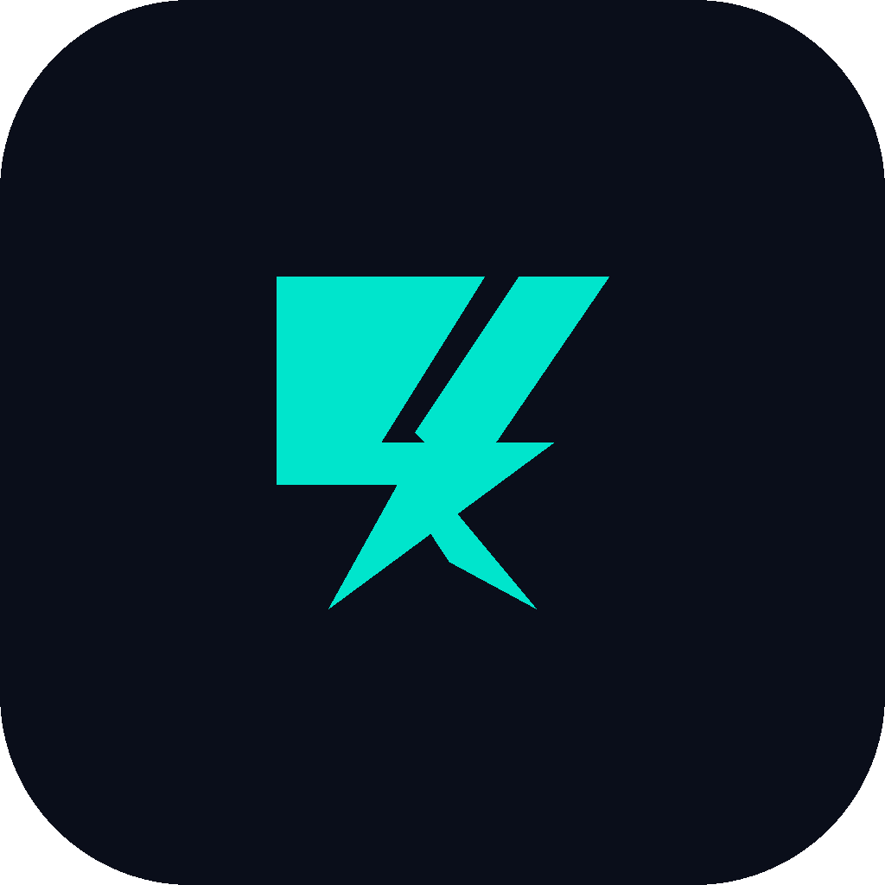
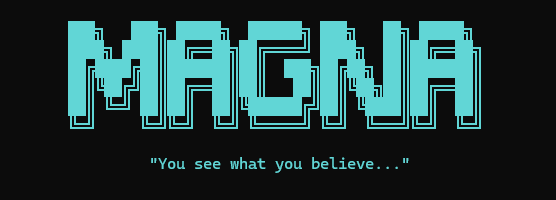

<div align="center">
  
  <h1>AICLI</h1>
  <p><em>Motor de contexto inteligente para Claude Code.</em></p>
  <p>
    
    
    
    
  </p>
  <p><strong>Arranca cada sesión de Claude Code en ~30 segundos con el contexto exacto del proyecto.</strong></p>
</div>

---



---

## El problema

Claude Code arranca cada sesión desde cero. Sin contexto, los primeros minutos se van en explorar el proyecto, entender la arquitectura y recordar las convenciones del equipo. En un proyecto de miles de archivos, ese costo se repite en cada ticket.

**AICLI lo resuelve.** Documenta tu proyecto una sola vez y entrega a Claude exactamente el contexto que necesita para la tarea actual — ni más ni menos.

## Antes / Después

**Sin AICLI**
```
Abrís Claude Code → explicás el stack → describís las convenciones →
recordás qué archivo tiene el problema → Claude empieza a explorar.
Costo: 5-10 minutos por sesión, multiplicado por cada ticket.
```

**Con AICLI**
```
ctx task "arreglar el filtro de fecha en el reporte de ventas"
→ Claude Code abre con: rol de senior developer + arquitectura del proyecto
  + módulos relevantes + plan técnico + el archivo exacto del problema.
Costo: ~30 segundos.
```

## Cómo funciona

1. **`ctx init`** escanea el proyecto y documenta la arquitectura en una sola llamada a Claude API
2. **`ctx proyecto`** genera conocimiento estructural — SQL real, convenciones, módulos clave
3. **`ctx file <zona>`** profundiza en la carpeta específica antes del ticket
4. **`ctx task`** detecta con _extended thinking_ qué módulos son relevantes y genera un plan técnico
5. Claude Code abre con todo el contexto ya cargado — sin exploración manual
6. **`ctx sync`** detecta los cambios con git y actualiza la documentación post-tarea

El knowledge store vive en `~/.mycontext/` — completamente fuera de cualquier repositorio de cliente.

## Comandos

| Comando | Qué hace |
|---------|----------|
| `ctx init` | Mapea la arquitectura del proyecto activo con IA |
| `ctx proyecto` | Genera `PROYECTO.md` con conocimiento estructural inferido del código |
| `ctx file <carpeta>` | Documenta en profundidad una zona específica del proyecto |
| `ctx archive <ruta>` | Analiza y documenta un archivo individual en detalle |
| `ctx task "descripción"` | Detecta módulos relevantes, genera plan técnico y lanza Claude Code |
| `ctx sync` | Detecta cambios con git y actualiza la documentación post-tarea |
| `ctx claude` | Lanza Claude Code con el contexto completo del proyecto |
| `ctx status` | Muestra los módulos documentados del proyecto activo |
| `ctx snapshot` | Guarda un punto de restauración del knowledge store |

## Contexto que recibe Claude

Cada sesión arranca con esta estructura, en este orden:

```
rol.md              ←  Rol de senior developer + reglas de comportamiento
PROYECTO.md         ←  Arquitectura real, patrón SQL, convenciones del equipo
Módulos relevantes  ←  Documentación de los archivos específicos de la tarea
Plan técnico        ←  Pasos concretos generados antes de abrir Claude Code
Archivo de entrada  ←  El archivo exacto donde ocurre el problema
```

## Instalación

### Opción A — Ejecutable directo (Windows, recomendado)

Descargá `ctx.exe` desde [Releases](https://github.com/Alejandro5668/AICLI/releases) y ejecutalo.
La primera vez te pide tu API key de Anthropic — se guarda en `~/.mycontext/.env`.

### Opción B — Desde el código fuente

```bash
git clone https://github.com/Alejandro5668/AICLI.git
cd AICLI
python -m venv .venv
.venv\Scripts\activate
pip install -r requirements.txt
python main.py
```

Necesitás una [API key de Anthropic](https://console.anthropic.com) — `console.anthropic.com` → API Keys.

## Stack

| Librería | Versión | Rol |
|----------|---------|-----|
| Python | 3.11+ | Lenguaje base |
| Typer | 0.26 | Estructura de comandos CLI |
| Rich | 15 | Output visual en terminal |
| SQLModel + SQLite | 0.0.38 | Knowledge store local en `~/.mycontext/` |
| Anthropic SDK | 0.107 | Claude API — análisis, documentación, extended thinking |
| questionary | 2.1 | Menú interactivo con navegación por flechas |

## Arquitectura

```
AICLI/
├── aicli/
│   ├── commands/
│   │   ├── init.py        # ctx init     — mapea arquitectura del proyecto
│   │   ├── file_cmd.py    # ctx file     — documenta una zona en profundidad
│   │   ├── archive.py     # ctx archive  — analiza un archivo individual
│   │   ├── sync.py        # ctx sync     — sincroniza documentación post-tarea
│   │   ├── proyecto.py    # ctx proyecto — genera PROYECTO.md
│   │   ├── task.py        # ctx task     — extended thinking + brief técnico
│   │   ├── claude_cmd.py  # ctx claude   — lanza Claude Code con contexto completo
│   │   ├── status.py      # ctx status   — panel de módulos documentados
│   │   └── snapshot.py    # ctx snapshot — punto de restauración
│   ├── db/
│   │   └── models.py      # Modelos Project y Module (SQLModel)
│   └── services/
│       ├── indexer.py     # Análisis e indexación con Claude API
│       ├── builder.py     # Ensambla el session_context.md por sesión
│       └── caller.py      # Lanza Claude Code como subprocess
├── knowledge/             # Decisiones técnicas, patrones y estado del proyecto
├── assets/                # Logo e íconos
├── main.py                # Entry point — menú interactivo principal
├── requirements.txt       # Dependencias de runtime
└── requirements-build.txt # Dependencias de build (PyInstaller)
```

---

<div align="center">
  <sub>Hecho por <a href="https://github.com/Alejandro5668">Alejandro Campo</a></sub>
</div>