# MAGNA — Flujo de resolución de casos

```mermaid
flowchart TD
    START([Caso en Jira])

    START --> TASK_ENTRY["ctx task\nIngresar Ticket ID"]

    %% ── Jira auto-fetch ─────────────────────────────────────────────────────
    TASK_ENTRY --> JIRA_CFG{¿Jira\nconfigurado?}
    JIRA_CFG -->|Primera vez| JIRA_SETUP["Setup guiado\nURL · Email · API Token\n(se guarda en .env)"]
    JIRA_SETUP --> JIRA_FETCH
    JIRA_CFG -->|Sí| JIRA_FETCH["Fetch automático\nDescripción · Imágenes\npre-cargado en TextArea"]
    JIRA_CFG -->|Omitir ticket| TASK_DESC

    JIRA_FETCH --> TASK_DESC["TextArea multilinea\n(editable · ctrl+↵ confirmar)"]

    %% ── Documentación previa ────────────────────────────────────────────────
    TASK_DESC --> CHECK{¿Módulo\ndocumentado?}

    CHECK -->|No| FILE["ctx file\nDocumentar carpeta completa"]
    FILE  --> ARC1["ctx archive\nAnalizar archivo en profundidad"]
    ARC1  --> DETECT

    CHECK -->|Sí| STALE{¿Archivo\nmodificado?}
    STALE -->|Sí| ARC2["ctx archive\nRefrescar documentación"]
    STALE -->|No| DETECT
    ARC2  --> DETECT

    %% ── IA + Claude ─────────────────────────────────────────────────────────
    DETECT["Detección de módulos con IA\nPlan de implementación"]
    DETECT --> WORK["Claude Code\n(terminal: MAGNA · SOL-515)"]

    WORK --> SYNC["ctx sync\nSincronizar documentación post-tarea"]

    SYNC --> PR[Se crea PR]

    %% ── Revisión del PR ─────────────────────────────────────────────────────
    PR --> PRCHECK{¿Hay comentarios\ncríticos?}

    PRCHECK -->|No| APPROVED([✔  PR aprobado — FIN])

    PRCHECK -->|Sí| REVISION["ctx revision\nLeer comentarios del PR\nResolver críticos con Claude"]

    REVISION --> RESOLVED{¿Críticos\nresueltos?}

    RESOLVED -->|Sí| APPROVED2([✔  PR aprobado — FIN])

    %% ── PR reabierto ────────────────────────────────────────────────────────
    RESOLVED -->|PR reabierto| RESUME["ctx resume\nRetomar ticket con historial\nde rondas anteriores"]

    RESUME --> REWORK["Claude Code retoma con\ncontexto acumulado"]

    REWORK --> SYNC2["ctx sync\nSincronizar nueva ronda"]

    SYNC2 --> PR2[Se crea nuevo PR]

    PR2 --> PRCHECK2{¿Hay comentarios\ncríticos?}

    PRCHECK2 -->|No| APPROVED3([✔  PR aprobado — FIN])

    PRCHECK2 -->|Sí — iteración| REVISION

    %% ── Estilos ─────────────────────────────────────────────────────────────
    classDef cmd    fill:#0d1a2a,stroke:#00d7ff,color:#00d7ff
    classDef gate   fill:#111111,stroke:#333333,color:#c9d1d9
    classDef end_ok fill:#0a1a0a,stroke:#00ff87,color:#00ff87
    classDef start  fill:#0a0a0a,stroke:#555555,color:#555555
    classDef jira   fill:#0d1a0d,stroke:#5B8DEF,color:#5B8DEF

    class FILE,ARC1,ARC2,DETECT,SYNC,SYNC2,REVISION,RESUME cmd
    class WORK,REWORK cmd
    class TASK_ENTRY,TASK_DESC cmd
    class JIRA_SETUP,JIRA_FETCH jira
    class CHECK,STALE,PRCHECK,PRCHECK2,RESOLVED,JIRA_CFG gate
    class APPROVED,APPROVED2,APPROVED3 end_ok
    class START start
```

## Comandos del flujo

| Comando | Cuándo usarlo |
|---------|---------------|
| `ctx task` | Siempre — punto de entrada. Ingresás el ticket ID y MAGNA auto-fetcha Jira |
| `ctx file` | Módulo nuevo — documenta toda la carpeta antes de trabajar en ella |
| `ctx archive` | Archivo específico nuevo o modificado — documentación en profundidad |
| `ctx sync` | Después de completar la tarea — antes del PR |
| `ctx revision` | Al recibir comentarios críticos en el PR |
| `ctx resume` | PR reabierto — retoma con historial completo de rondas anteriores |

## Lo que hace ctx task automáticamente

1. **Ticket ID** — ingresás `SOL-515`
2. **Jira fetch** — MAGNA trae descripción + adjuntos del ticket vía API
   - Primera vez: setup guiado (URL, email, token) → guardado en `~/.mycontext/.env`
   - Las imágenes adjuntas se analizan con visión Claude y se incluyen en el contexto
3. **TextArea** — descripción pre-cargada desde Jira, editable, soporta multilinea y paste
4. **Detección de módulos** — IA identifica qué partes del código tocar
5. **Plan de implementación** — brief técnico generado antes de lanzar Claude
6. **Claude Code** — lanza con contexto completo: proyecto + ticket Jira + plan + evidencia visual
   - El título de la terminal se setea a `MAGNA · SOL-515` para identificar sesiones paralelas
   - Cada sesión usa un `session_context_YYYYMMDD_HHMMSS.md` único (se purgan a las 4h)

## Tab AHORA — radar de trabajo

El panel derecho de la TUI muestra en tiempo real (cargado desde Jira al abrir):

- **EN CURSO** — tickets que tenés en desarrollo
- **PENDIENTE · ALTA PRIORIDAD** — TO DOs con prioridad High/Critical asignados a vos
- **REABIERTOS** — tickets que volvieron de QA

## Reglas del flujo

- `ctx task` siempre detecta los módulos relevantes con IA antes de lanzar Claude
- `ctx sync` actualiza la documentación para que la siguiente ronda tenga contexto fresco
- `ctx resume` preserva el historial completo de rondas anteriores — Claude no empieza desde cero
- Un módulo modificado por la tarea anterior necesita `ctx archive` antes de la siguiente
- Jira es opcional — si no ingresás ticket ID el flujo funciona igual que antes
