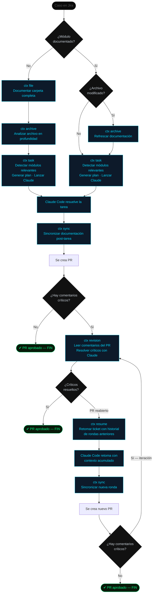

# MAGNA — Flujo de resolución de casos

## Comandos del flujo

| Comando | Cuándo usarlo |
|---------|---------------|
| `ctx file` | Módulo nuevo — documenta toda la carpeta |
| `ctx archive` | Archivo específico nuevo o modificado |
| `ctx task` | Siempre — punto de entrada al trabajo con Claude |
| `ctx sync` | Después de completar la tarea — antes del PR |
| `ctx revision` | Al recibir comentarios críticos en el PR |
| `ctx resume` | PR reabierto — retoma con historial de rondas |

## Reglas del flujo

- `ctx task` siempre detecta los módulos relevantes con IA antes de lanzar Claude
- `ctx sync` actualiza la documentación para que la siguiente ronda tenga contexto fresco
- `ctx resume` preserva el historial completo de rondas anteriores — Claude no empieza desde cero
- Un módulo modificado por la tarea anterior necesita `ctx archive` antes de la siguiente
